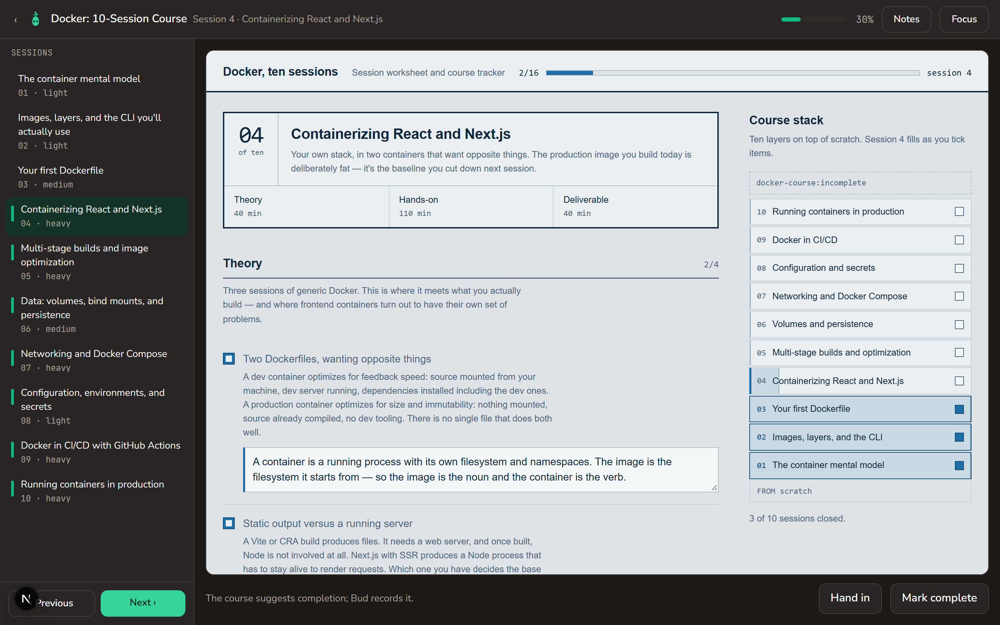
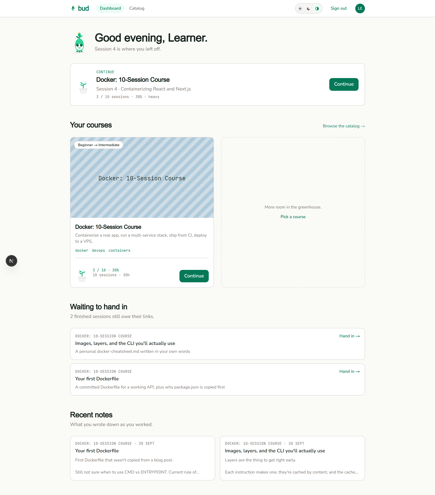
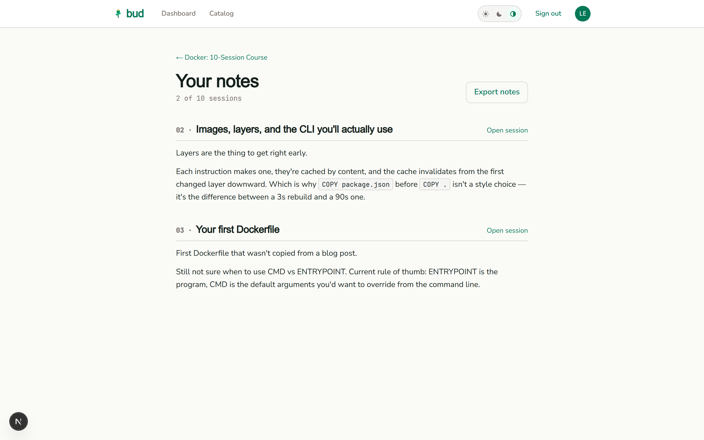
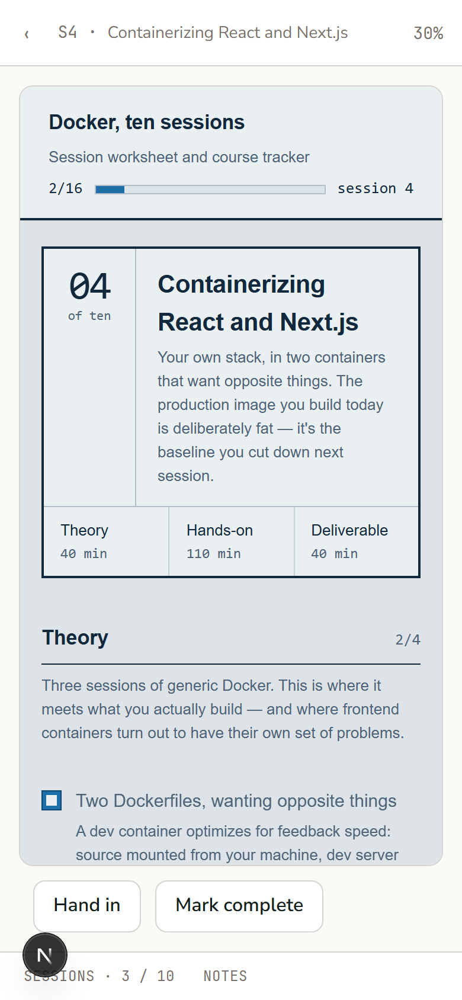

# Bud

A learning platform where **a course is somebody else's JavaScript**. You upload a zip of HTML worksheets; Bud serves them from a separate origin, runs them in a sandboxed iframe, and gives them a storage API so a learner's work survives a refresh. The interesting problem is not the app around that — it is that the course is untrusted code holding a learner's notes, and the shell has to hand it real data without ever letting it leave.

<!-- Live demo: not yet deployed. Add the URL here once it is. -->



That screenshot is the whole architecture in one frame. The chrome is dark because that is Bud's theme; the worksheet inside it is light because it is a **different document on a different origin**, with its own CSS, that Bud deliberately does not reach into — and could not, if it wanted to.

---

## The part worth reading

### The sandbox is demonstrated, not asserted

Most projects claim an iframe is safe. This one ships an attack that tries to break it, and fails on purpose:

```console
$ node tools/bridge-leak-probe.mjs

════ result ════
control                        data reached attacker: no
navigate-away                  data reached attacker: no
attacker-hello                 data reached attacker: no
navigate-back                  data reached attacker: no
popup-port                     data reached attacker: no
popup-url                      data reached attacker: no

OK: the bridge delivers only to the document that asked.

with allow-popups added back — why the player does not set it:
  popup-port                   data reached attacker: YES
  popup-url                    data reached attacker: YES
```

The last two lines are the point. They are a *counter-demonstration*: the same probe, with one sandbox flag added back, showing the learner's data walking out — so the reason `allow-popups` is absent from the player is a result rather than an opinion.

**What it found.** The shell used to answer a course's `storage.get` by posting the result to the frame's `window`. A `WindowProxy` tracks the browsing *context*, not the *document* — so a course could ask for its learner's saved work, navigate its own frame to another page it had uploaded, and receive the answer there. The obvious guard, re-comparing the window handle before replying, does not work: the probe leaks in runs that report the handles as different. Replies now travel over a transferred `MessagePort`, which belongs to the document that received it, so after a navigation there is nothing to deliver to and nothing to check. Structural rather than a timing check, and cheaper than the guard that doesn't work.

**Scope it honestly**, because a portfolio claim that falls over under one question is worth less than no claim:

- This is **reply integrity, not a completed theft**. A course is entitled to its own learner's state. Separate layers — `frame-src` in the shell's CSP, `connect-src 'none'` and a `sandbox` directive on every course response, no `allow-popups` — mean the leaked reply could not have left the browser anyway. The point is that the bridge no longer *depends* on those holding.
- The probe runs the real `public/bridge.js`, read off disk, against a **stand-in shell** that does what the React hook does — not the hook itself. The player's real flags are pinned elsewhere: `e2e/security.spec.ts` reads the iframe's own `sandbox` attribute *and* the `sandbox` directive the courses origin sends, and fails unless they match flag for flag — two independently-maintained copies that have to agree, since looser on the server is a hole and tighter breaks courses in the player.
- Course JavaScript is **not** locked down in general: the courses-origin CSP carries `unsafe-inline` for script and style, because the worksheets ship inline `<script>` and `<style>`. What is closed is the network — `connect-src 'none'`, `form-action 'none'`, no popups, no top-level navigation.

### It is built for a server that falls asleep

The whole thing runs on free tiers, which means the API sleeps after 15 idle minutes and takes about a minute to wake. That constraint shaped more of the code than any feature did — and the interesting half is not the spinner, it is refusing to lose work:

- **Writes are queued per key**, so a retried save can never land on top of a newer one, even after moving between sessions.
- **A course whose saved state failed to load cannot save over it.** The shell marks the key and refuses the next write until a fresh read proves what is there — because the shipped worksheets swallow a failed load and carry on with a blank sheet, whose next autosave would write that blank over everything.
- **There is no `loading.tsx` anywhere**, deliberately: a streamed loading screen commits the HTTP status before the layouts run, which turns real 404s and sign-in redirects into soft ones.
- **`tools/sleepy-proxy.mjs`** is an API you can put to sleep, because server components call the API where Playwright cannot intercept.

### What this deliberately is not

- **Not deployed yet.** Everything above runs locally. No live URL to link.
- **Not "fully tested."** There is no unit-test runner at all: it is 140 Playwright tests across 16 files, end to end against the real API, of which 4 skip unless you stand up a sleepable proxy. The suite is deliberately kept *out* of CI, because it skips itself without the API and would be green while proving nothing. CI runs typecheck, lint, a production build, a build that must refuse blank origins, the leak probe, and a container build with a vulnerability scan.
- **Not multi-user.** One learner and one admin, on purpose.
- **One course.** The Docker package in `courses/` is third-party HTML that was never adapted to Bud — which is the point of the bridge, but it is one course, not a library.

## Screenshots

| | |
|---|---|
|  |  |
| The dashboard: what is owed, and what you wrote as you worked | Every note for a course, in session order, exportable as Markdown |



The player has a second layout on a phone: the session rail and notes become tabs in a bottom sheet.

---

## Run it

This is the shell (`bud-web`). The API is the sibling `Bud - backend` project, and the planning lives one folder up in `../Planning/` — `Design-Mockups.md` for what the screens are meant to look like, `Roadmap-Status.md` for where the whole project stands.

```bash
npm install
npm run dev
```

That starts two servers, on purpose:

| | URL | What |
|---|---|---|
| app | http://localhost:3100 | The Next.js shell |
| courses | http://127.0.0.1:3101 | Course HTML, with `bridge.js` injected and a strict CSP |

They must stay on **different hosts**, not just different ports: cookies ignore ports, so `localhost` vs `127.0.0.1` is what keeps course JavaScript away from the session cookie in development. Ports 3100/3101 rather than 3000/3001 because both of those were already in use on the dev machine; override with `COURSES_PORT` and `next dev -p`.

Auth needs a third process, the API from the sibling `Bud - backend` project, on **http://localhost:3102** (`npm run start:dev` there, with its Postgres container up).

**The browser never calls the API directly.** It calls `/api/*` on the shell's own origin, and a rewrite in `next.config.ts` forwards the request to `BUD_API_ORIGIN`. Only the API's own prefixes are forwarded (`auth`, `me`, `courses`, `admin`, `course-spec`, `health`, `ready`), so a new top-level API prefix needs adding there. Development works the same way as production. The reason is the free hosts: the app on `*.vercel.app` and the API on `*.onrender.com` are different *sites*, because both are public suffixes, so the API's `SameSite=Lax` session cookie would never cross between them. Sign-in would appear to work, and then every page would bounce back to `/login`. Through the rewrite, the cookie is first-party on the app's host, which is also where server components read it. Server components skip the detour: they call `BUD_API_ORIGIN` directly and forward the cookie themselves.

| Variable | What | Read |
|---|---|---|
| `NEXT_PUBLIC_APP_ORIGIN` | the shell's own origin | build time |
| `NEXT_PUBLIC_COURSES_ORIGIN` | where course HTML is served. It must differ from the app's origin | build time |
| `BUD_API_ORIGIN` | where the API really is. Server-only | build time (the rewrite) and runtime (server components) |

All three default to the local ports above. A **production build fails** if any of them is blank or has a path: the first deploy shipped with all three blank, and the only sign was a CSP with no origins in it. On Vercel, set them under *Settings → Environment Variables*, then redeploy.

**http://localhost:3100/brand** is the brand gallery: every piece of artwork at every size the screens use — Bud's three poses, the mark and wordmark, the growth meter across course lengths, and the fallback course cover. It is kept as a living styleguide and is the target for `e2e/brand.spec.ts`.

The two throwaway harnesses that came before the real screens — `/spike` for the bridge and `/dev/auth` for the typed client — are gone. The player and the login screen now cover both against the real API.

## Container

```bash
docker build -t bud-web .
docker run --rm -p 3100:3100 bud-web
```

The three origins are fixed at build time: `NEXT_PUBLIC_*` values are inlined into the client bundle, and `BUD_API_ORIGIN` is compiled into the `/api` rewrite. They are build arguments rather than runtime environment, so an image built for one environment can't be re-pointed at another by changing env vars. Build a new image instead:

```bash
docker build -t bud-web \
  --build-arg NEXT_PUBLIC_APP_ORIGIN=https://app.example \
  --build-arg NEXT_PUBLIC_COURSES_ORIGIN=https://courses.example \
  --build-arg BUD_API_ORIGIN=https://api.example .
```

That is also why CI publishes an image only once there is somewhere to build it for. It always builds and scans one, so the Dockerfile is never broken unnoticed, but it pushes `ghcr.io/<owner>/bud-web` from `main` only when the three origins are set as **repository variables** (*Settings → Secrets and variables → Actions → Variables*). Unset, it says so in the run's summary and skips the push.

The runtime stage carries Next's `standalone` output rather than `node_modules`, runs as the non-root `node` user, and serves with `node server.js` — `next` itself is not installed in that stage.

Two things differ when the shell serves `/api` itself (the image, `next start`) rather than behind Vercel, whose edge router handles rewrites on its own:

- **The API sees the shell's IP, not the learner's.** Next's rewrite passes on an `X-Forwarded-For` that something in front of it set, and never adds one itself. With nothing in front, every learner shares one per-IP rate-limit bucket, and one person's failed logins can lock an account for everyone. Put a proxy that sets `X-Forwarded-For` in front of the shell. Then point `BUD_API_ORIGIN` at the API's internal address, so a proxy in front of the API doesn't overwrite the header with the shell's address.
- **Request bodies are capped** at `experimental.proxyClientMaxBodySize`, which is sized from the 50 MB course-archive ceiling in `src/lib/config/limits.ts`. Next's default is 10 MB, which cut uploads off mid-transfer.

## Checks

```bash
npm run typecheck
npm run lint
npx playwright test
node tools/bridge-leak-probe.mjs
```

`npm run lint` covers `src`, `e2e`, `tools` and `next.config.ts`. `npx eslint .` works too but is slow; it walks the build output. The specs that need the API skip with a message when it isn't running, so a red suite always means the frontend broke.

**CI** (`.github/workflows/ci.yml`) runs on every push and pull request: typecheck, lint, a production build, a check that a build still refuses blank origins, the bridge leak probe, and the container build with a vulnerability scan. The Playwright suite is deliberately *not* in CI — it skips itself without the API, so it would be green while proving nothing.

### Cold starts

On the $0 deploy the API sleeps after 15 idle minutes and takes about a minute to wake. What the shell does about it:

- **Browser calls** show a "waking up" notice once they have waited four seconds. A call that a gateway answered for is retried twice, after 4 and then 12 seconds. Only calls that are safe to repeat are retried.
- **Course-state writes and notes** share one queue per tab (`src/components/player/stateWrites.ts`) and stay in order per key, even across sessions. One that finally fails is sent again later; closing the tab warns until it lands, and signing out says what it is about to throw away.
- **A course whose saved work failed to load** can't save over it.
- **Server renders** give up after 5 seconds. The error page then checks `/api/ready` itself, and carries on as soon as the API answers.

`e2e/waking.spec.ts` covers the browser side by intercepting `/api`. The server side can't be intercepted, so `e2e/cold-start.spec.ts` needs a shell built in front of a proxy that can be put to sleep:

```bash
node tools/sleepy-proxy.mjs
```

```bash
BUD_API_ORIGIN=http://127.0.0.1:3197 npm run build && BUD_API_ORIGIN=http://127.0.0.1:3197 npx next start -p 3100
```

```bash
BUD_API_ORIGIN=http://127.0.0.1:3197 BUD_SLEEPY_PROXY=http://127.0.0.1:3197 npx playwright test
```

The proxy passes everything through while it's awake, so the whole suite runs that way. Without `BUD_SLEEPY_PROXY`, the cold-start spec skips.

## The API contract

`src/lib/api/schema.d.ts` is generated from the backend's own OpenAPI document and committed, so the repo typechecks without the API running. Regenerate it whenever the backend changes the spec:

```bash
npm run api:types
```

The backend publishes the spec at `http://localhost:3102/docs/openapi.json` (Swagger UI at `/docs`) and is the single source of truth for it — the frontend never hand-writes a request or response shape. Everything else in `src/lib/api/` is a thin layer over that: `credentials: "include"` on every call, since the session is an httpOnly cookie, and non-2xx responses turned into a `BudApiError` carrying the API's error envelope.

`e2e/api-client.spec.ts` runs that client from Node against the real API, with a session cookie forwarded by hand — the same way server components call it. It's what keeps the client honest for endpoints no screen uses yet.

## Security

Course HTML is author-controlled JavaScript, so most of what keeps a learner's work safe is about what a course *cannot* do. Each rule below was found by trying to break it, and each has a test.

| Rule | Where | Why |
|---|---|---|
| Courses run on a different **host**, sandboxed without `allow-same-origin` | player iframe | Cookies ignore ports; an opaque origin cannot read the shell's cookies, storage or DOM |
| Bridge replies travel over a **MessagePort**, never to the frame's window | `public/bridge.js`, `useCourseBridge` | A `WindowProxy` follows the frame across navigation, so a reply to the window could land on a page the course navigated to. Re-checking the handle does not help |
| **No `allow-popups`** | player iframe | A popup is an unpoliced way out: the learner's data rides in a `window.open` URL, or the course hands the bridge port to the popup |
| **`frame-src`** names only the courses origin | `src/lib/security/csp.ts` | A course can navigate its own frame to `https://evil/?d=…`. Nothing the courses origin sends can stop that; only the embedder's `frame-src` can |
| **`script-src` with a per-request nonce** and `'strict-dynamic'` | `src/proxy.ts` | No inline or injected script runs unless Next rendered it for this request |
| **`connect-src 'self'`**: the API is reached only through `/api` | `next.config.ts`, `src/lib/security/csp.ts` | The session cookie stays first-party on the app's host. The API's real address is not in the policy, so a script has one fewer place to send data |
| **`/api` forwards only the API's own prefixes**, and never a `/{slug}/{version}/…` path | `next.config.ts` | On the free deploy the API's host also serves course content. A catch-all rewrite put course HTML on the shell's origin, top-level and outside the sandbox, with the learner's session a same-origin `fetch` away |
| **Course documents sandbox themselves**: a CSP `sandbox` with exactly the iframe's flags | the backend's course server, `tools/courses-server.mjs` | A course reached outside the player (opened directly, or through any proxy) still gets an opaque origin. The flags must match the iframe's: looser is a hole, tighter breaks courses in the player |
| **Learner-supplied links are parsed before they reach an `href`** | `src/lib/safe-href.ts` | A deliverable is a URL someone typed. `javascript:` in an href runs in the shell's own origin when clicked. The API refuses anything but http(s) on the way in; this refuses it on the way out, for values that predate a validator or come from an endpoint written later |

The CSP is built per request in `src/proxy.ts` from `src/lib/security/csp.ts`, which is where to read the reasoning for each directive. Two consequences worth knowing:

- **Every page renders per request** — the root layout opts in, because Next can only stamp a nonce while rendering against a live request. Nothing is prerendered, `/brand` included.
- **`style-src` is split.** Components use React `style={…}` props, which render as `style` attributes that a nonce cannot cover, and once a directive holds a nonce browsers ignore `'unsafe-inline'` in it. So `<style>` elements are nonced (`style-src-elem`) and attributes are allowed (`style-src-attr`).

`node tools/bridge-leak-probe.mjs` runs the real `bridge.js` on two real origins and fails if a learner's data can reach a document the course chose. `e2e/security.spec.ts` checks the shell's policy, including that no page in the app violates it.

## Layout

```
courses/docker-fundamentals/1.0.0/   the Docker course package + bud.manifest.json
public/bridge.js                     injected into every course HTML entry
tools/courses-server.mjs             the courses origin, for development
tools/bridge-leak-probe.mjs          guards the bridge against the exfiltration routes above
tools/sleepy-proxy.mjs               an API you can put to sleep, for the cold-start spec
src/proxy.ts                         the per-request nonce and CSP
src/lib/config/origins.ts            the three origins, and the production build's check of them
src/lib/config/limits.ts             how large an upload the /api rewrite can carry
src/components/player/stateWrites.ts one write queue per tab: ordering, re-sends, "is anything unsaved?"
src/lib/safe-href.ts                 the only way a learner's link reaches an href
src/lib/security/csp.ts              the policy itself, and why each directive is there
src/app/                             routes
e2e/                                 Playwright
```

## What the bridge spike established

The spike is the go/no-go for the whole architecture. It passed, and it surfaced six things the planning docs did not have:

1. **`storage.delete` is required.** Every worksheet calls it from "Clear saved work". The bridge contract in `Overall Plan.md` only had `get` and `set`.
2. **Ten storage keys, not one.** Session 1 uses `docker-course:state`; sessions 2–10 use `docker-course:session-N`. The manifest lists all ten.
3. **The shell must not load a course before it is listening.** Server-rendered, the iframe starts loading before hydration, the worksheet's first `storage.get` reaches a parent with no listener, and the course silently starts blank. The frame's `src` is now set only after the listener is attached.
4. **The sandbox needs `allow-modals`.** Every worksheet `confirm()`s before clearing; without the flag `confirm()` returns `false` and nothing happens. Dialogs grant no access, so the isolation boundary is unchanged.
5. **The frame needs `allow="clipboard-write"`.** Export and the copy buttons use `navigator.clipboard.writeText`, which a cross-origin frame only gets when delegated.
6. **A hanging external stylesheet stalls the course.** The worksheets load Google Fonts render-blocking; when that request hangs rather than fails, the worksheet's own script never runs. The player needs a load timeout with a visible "still loading" state. The e2e tests abort font requests so they are deterministic.

And two that confirmed the design: the frame's origin is opaque (`"null"`) with `document.cookie` blocked, and the worksheets needed **no changes**.
